# Understanding spec-kit: A Visual Guide

> A comprehensive guide to understanding the spec-kit development workflow, from concept to implementation.

## Table of Contents

1. [What is Spec-Driven Development?](#what-is-spec-driven-development)
2. [The Power Inversion](#the-power-inversion)
3. [The Three Core Folders](#the-three-core-folders)
4. [The Cooking Analogy](#the-cooking-analogy)
5. [Architecture Overview](#architecture-overview)
6. [Real-World Example: Building chan-meng CLI](#real-world-example-building-chan-meng-cli)
7. [Complete Workflow](#complete-workflow)
8. [Constitutional Foundation](#constitutional-foundation)
9. [Template-Driven Quality](#template-driven-quality)
10. [Detailed Command Flow](#detailed-command-flow)
11. [File Relationships](#file-relationships)
12. [Getting Started](#getting-started)

---

## What is Spec-Driven Development?

**Spec-Driven Development (SDD)** flips the script on traditional software development. For decades, code has been king—specifications were just scaffolding we built and discarded once the "real work" of coding began. **SDD changes this: specifications become executable**, directly generating working implementations rather than just guiding them.

### Key Benefits

- ✅ **Specifications as Source of Truth**: Code serves specs, not the other way around
- ✅ **Intent-Driven Development**: Express requirements in natural language
- ✅ **Eliminates Spec-Code Gap**: No more drift between documentation and reality
- ✅ **AI-Optimized Workflow**: Designed to leverage AI's full capabilities
- ✅ **Constitutional Enforcement**: Immutable principles guide every decision
- ✅ **Test-First Always**: Tests are generated before implementation

---

## The Power Inversion

### Traditional Development Flow

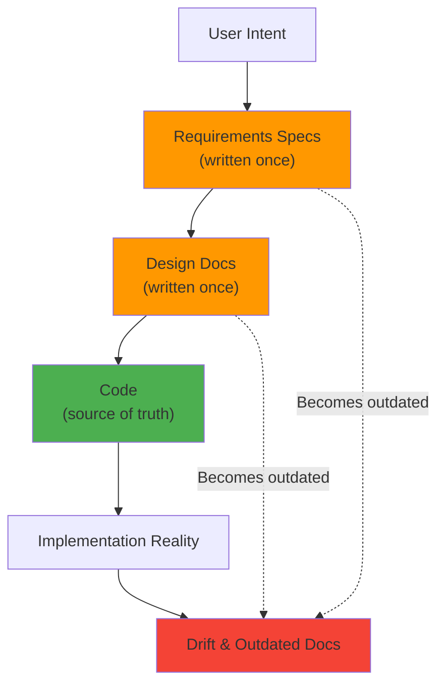

### Spec-Driven Development Flow

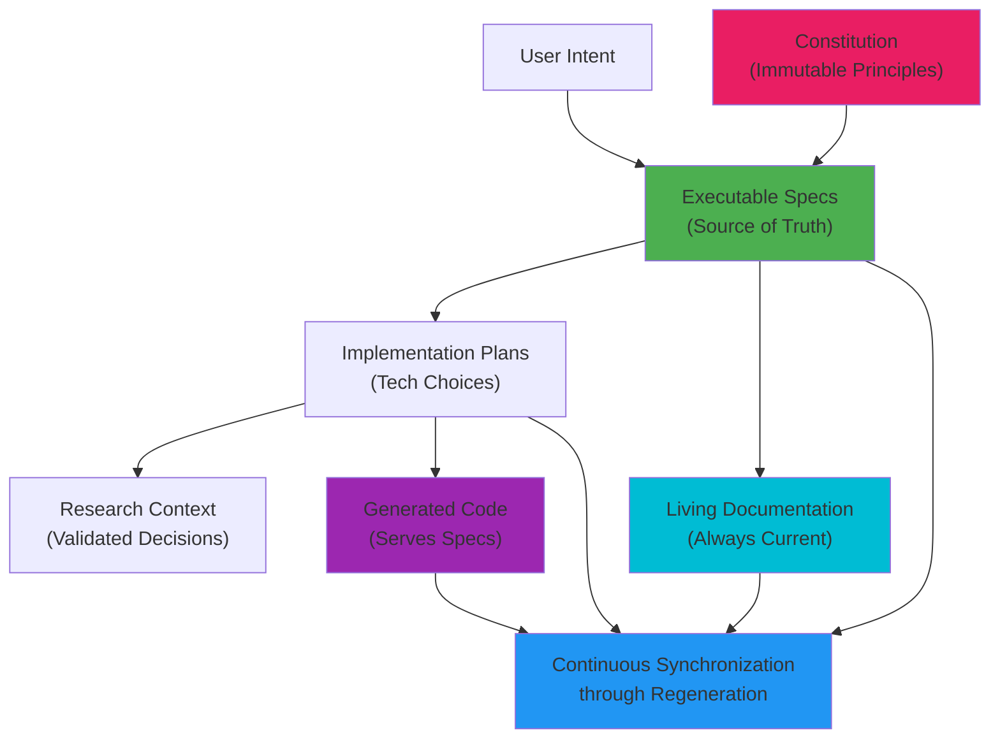

### Why This Matters

1. **No More Drift**: Specifications and code stay in perfect sync because code is generated from specs
2. **Easier Pivots**: Change requirements in specs → regenerate implementation → done
3. **Living Documentation**: Docs are never outdated because they generate the code
4. **Parallel Exploration**: Same spec can generate different implementations (performance vs maintainability)
5. **Amplified Creativity**: Developers focus on "what and why" rather than mechanical translation

---

## The Three Core Folders

spec-kit uses three main folders, each with a distinct purpose:

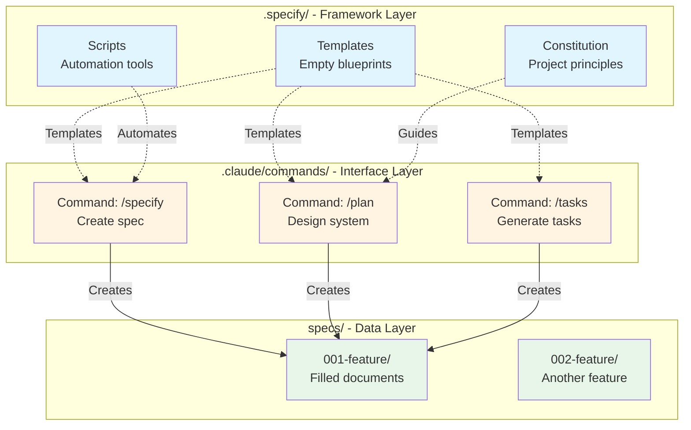

### 1. `.specify/` - The Framework Layer 🏗️

**Purpose**: Contains the reusable, generic framework that defines HOW to document features.

**Structure**:
```
.specify/
├── templates/              # Empty document templates
│   ├── spec-template.md    # Feature specification blueprint
│   ├── plan-template.md    # Implementation plan blueprint
│   ├── tasks-template.md   # Task list blueprint
│   └── agent-file-template.md  # AI agent instructions
├── scripts/                # Automation scripts
│   └── bash/
│       ├── create-new-feature.sh
│       ├── setup-plan.sh
│       └── check-prerequisites.sh
└── memory/
    └── constitution.md     # Project principles & constraints
```

**Key Characteristics**:
- Generic and reusable
- No feature-specific content
- Defines structure, not content
- Version-controlled with your project

### 2. `specs/` - The Data Layer 📊

**Purpose**: Contains the concrete, feature-specific documentation generated from templates.

**Structure**:
```
specs/
└── 001-build-an-interactive/  # One feature directory
    ├── spec.md                # WHAT: Feature requirements
    ├── plan.md                # HOW: Technical approach
    ├── tasks.md               # TODO: Ordered task list
    ├── research.md            # WHY: Technical decisions
    ├── data-model.md          # DATA: Entities & relationships
    ├── quickstart.md          # TEST: Integration scenarios
    └── contracts/             # API: Request/response schemas
        ├── content-schema.json
        └── preferences-schema.json
```

**Key Characteristics**:
- Feature-specific content
- Generated from `.specify/` templates
- Each feature gets its own directory
- Evolves during development

### 3. `.claude/commands/` - The Interface Layer ⚡

**Purpose**: Defines slash commands that orchestrate the workflow by using templates to generate documents.

**Structure**:
```
.claude/commands/
├── specify.md       # /specify - Create initial feature spec
├── clarify.md       # /clarify - Resolve ambiguities
├── plan.md          # /plan - Generate implementation plan
├── tasks.md         # /tasks - Create task list
├── implement.md     # /implement - Execute tasks
├── analyze.md       # /analyze - Check consistency
└── constitution.md  # /constitution - Manage principles
```

**Key Characteristics**:
- Defines WHEN and in WHAT ORDER to do things
- Orchestrates template usage
- Calls `.specify/` scripts
- Produces `specs/` documents

---

## The Cooking Analogy 👨‍🍳

Understanding spec-kit is easier with a cooking analogy:

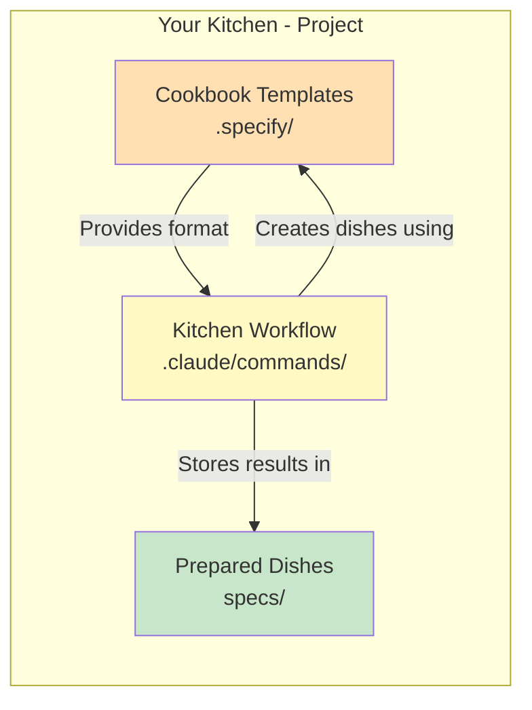

| Component | Cooking World | spec-kit World | Example |
|-----------|---------------|----------------|---------|
| **Templates** | Recipe Format | `.specify/templates/` | "Ingredients, Steps, Time" |
| **Constitution** | Kitchen Rules | `.specify/memory/constitution.md` | "No MSG, use organic" |
| **Commands** | Cooking Process | `.claude/commands/` | "Prep → Cook → Plate → Serve" |
| **Scripts** | Kitchen Tools | `.specify/scripts/` | Mixer, thermometer, timer |
| **Feature Docs** | Actual Recipes | `specs/001-xxx/` | "Kung Pao Chicken recipe" |
| **Code** | Finished Dish | `src/` | The meal served to users |

### The Complete Cooking Process

1. **Get Idea**: "I want Kung Pao Chicken" → User describes feature
2. **Check Template**: Open recipe format (blank) → Load `spec-template.md`
3. **Fill Recipe**: Write specific ingredients & steps → Generate `spec.md`
4. **Plan Cooking**: Decide order, tools, timing → Generate `plan.md`
5. **Create Checklist**: List each cooking step → Generate `tasks.md`
6. **Cook**: Follow checklist → Execute implementation
7. **Taste Test**: Verify it's good → Run tests & validation

---

## Architecture Overview

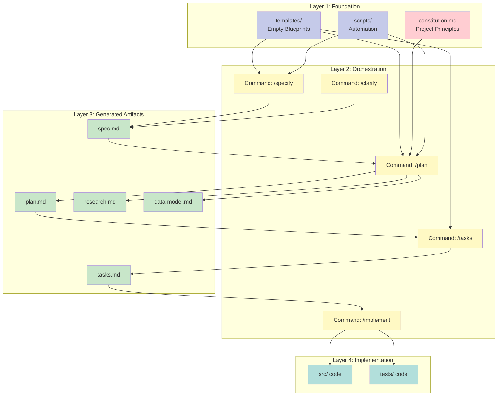

---

## Real-World Example: Building chan-meng CLI

This project—the chan-meng CLI you're reading about—was built using spec-kit! Let's walk through how it was developed to see SDD in action.

### The Project

**chan-meng** is an interactive NPX CLI that introduces Chan Meng through an engaging, story-driven terminal experience. Users can explore her minimalist lifestyle philosophy, life journey, and practical implementations through keyboard navigation.

### Development Journey

#### Step 1: Establishing the Constitution

First, we created the project principles in `.specify/memory/constitution.md`:

```markdown
## Core Principles

### I. Authenticity First
Every interaction must authentically represent Chan Meng's minimalist philosophy.
No embellishment or fictional elements allowed.

### III. Respect for User's Time (NON-NEGOTIABLE)
Users must be able to:
- Get a meaningful impression within 2 minutes
- Exit at any point without losing context
- Skip sections that don't interest them

### IV. Technical Simplicity
- Minimal dependencies (max 10 npm packages)
- Fast startup (< 2 seconds on average hardware)
- No external API calls or data collection
```

**Why This Matters**: These principles guided every subsequent decision. When planning technical implementation, the AI checked against these constraints automatically.

#### Step 2: Creating the Specification

Using `/specify`, we described the feature in natural language:

```bash
/specify Build an interactive CLI application that can be run via 'npx chan-meng'
to introduce Chan Meng through an engaging, story-driven experience.
The application should showcase Chan's extreme minimalist lifestyle journey,
from her constrained family life to her current life in New Zealand.
```

This generated `specs/001-build-an-interactive/spec.md` with:
- **28 Functional Requirements** (FR-001 through FR-028)
- **8 Acceptance Scenarios** with Given-When-Then format
- **4 Key Entities** (Content Module, Navigation State, User Preferences, Story Segment)

**Real Example from the Generated Spec**:

```markdown
FR-002: System MUST display a welcoming introduction screen within 5 seconds

FR-014: Text presentation MUST display content immediately without typewriter
effects to respect user's time and align with minimalist values

FR-024: System MUST persist user progress locally, tracking which modules
have been visited
```

Notice how these FRs trace directly back to the constitution's principles about user time and simplicity.

#### Step 3: Clarification Round

The `/clarify` command identified ambiguities and asked targeted questions:

```markdown
### Session 2025-10-02

Q: What is the maximum acceptable startup time?
A: < 5 seconds

Q: Should the CLI track user progress between sessions?
A: Yes - Remember visited modules and offer "resume where you left off"

Q: Should text be displayed with typewriter effect?
A: No typewriter effect - show all text immediately for speed
```

**Key Insight**: Without clarification, the AI might have assumed typewriter effects would be "engaging." The constitution's principle about respecting user time drove the question, and the answer prevented over-engineering.

#### Step 4: Technical Planning

Using `/plan`, we specified the tech stack:

```bash
/plan Use Node.js 18+ with battle-tested CLI libraries (inquirer, chalk, boxen).
Keep dependencies under 10 as per constitution. No external APIs, offline-first.
```

This generated:
- `plan.md` - Technical approach with constitutional compliance checks
- `research.md` - Library comparisons and best practices
- `data-model.md` - Content module structure
- `contracts/` - JSON schemas for preferences and content
- `quickstart.md` - Integration test scenarios

**Constitutional Checkpoint** in `plan.md`:

```markdown
## Constitution Check

### Principle IV (Technical Simplicity)
✅ PASS: 7 core dependencies (within 10 limit)
- inquirer (interactive prompts)
- chalk (terminal colors)
- boxen (styled boxes)
- figlet (ASCII art)
- conf (preferences storage)
- ora (loading spinners)
- gradient-string (text effects)

### Principle III (User Time Respect)
✅ PASS: Startup time target < 5s documented
✅ PASS: No forced animations or unskippable content
```

#### Step 5: Task Breakdown

The `/tasks` command analyzed the plan and generated an ordered task list in `tasks.md`:

```markdown
## Phase 3.1: Setup
- [ ] T001 Initialize Node.js project with package.json
- [ ] T002 Install CLI dependencies per plan.md

## Phase 3.2: Tests First (TDD)
- [ ] T003 [P] Contract test for preferences schema
- [ ] T004 [P] Integration test for welcome flow
- [ ] T005 [P] Integration test for Quick Tour mode

## Phase 3.3: Core Implementation
- [ ] T006 [P] Content module system in src/content/
- [ ] T007 [P] Navigation state manager in src/navigation/
- [ ] T008 Main menu interface in src/cli/menu.js
- [ ] T009 Welcome screen with ASCII art in src/cli/welcome.js

## Phase 3.4: Polish
- [ ] T010 [P] Add color schemes with graceful fallbacks
- [ ] T011 Terminal resize handling
- [ ] T012 Cross-platform compatibility testing
```

**Notice**:
- `[P]` marks tasks that can run in parallel (independent files)
- Tests come before implementation (T003-T005 before T006-T009)
- Each task specifies exact file paths

#### Step 6: Implementation

The `/implement` command executed tasks in order, following TDD:

1. **Write tests first** - Created failing tests for each contract
2. **Implement to pass tests** - Built features to make tests green
3. **Validate** - Ran tests, fixed issues
4. **Move to next task** - Systematic progression

**Example from T004 (Integration Test)**:

```javascript
// tests/integration/welcome-flow.test.js
describe('Welcome Flow', () => {
  it('should display welcome screen within 5 seconds', async () => {
    const start = Date.now();
    await runCLI();
    const elapsed = Date.now() - start;
    expect(elapsed).toBeLessThan(5000); // Constitutional requirement
  });

  it('should offer Quick Tour and Full Experience options', async () => {
    const output = await runCLI();
    expect(output).toContain('Quick Tour');
    expect(output).toContain('Full Experience');
  });
});
```

The test directly validates FR-002 (startup time) and FR-015 (experience modes) from the specification.

### The Results

**What We Got**:
- ✅ Fully functional CLI published to npm as `chan-meng`
- ✅ All 28 functional requirements implemented and tested
- ✅ 100% constitutional compliance (7 dependencies, <5s startup)
- ✅ Living documentation that matches reality exactly

**File Structure** (exactly as planned):

```
chan-meng/
├── .specify/
│   ├── memory/
│   │   └── constitution.md
│   ├── templates/
│   │   ├── spec-template.md
│   │   ├── plan-template.md
│   │   └── tasks-template.md
│   └── scripts/
├── specs/
│   └── 001-build-an-interactive/
│       ├── spec.md
│       ├── plan.md
│       ├── tasks.md
│       ├── research.md
│       ├── data-model.md
│       ├── quickstart.md
│       └── contracts/
├── src/
│   ├── cli/
│   │   ├── welcome.js
│   │   └── menu.js
│   ├── content/
│   ├── navigation/
│   └── index.js
└── tests/
    ├── contract/
    ├── integration/
    └── unit/
```

### Key Takeaways from This Example

1. **Constitution Prevented Over-Engineering**: Without the 10-dependency limit, we might have added React Ink, Zustand for state, and other heavy libraries. The constraint forced elegant simplicity.

2. **Specifications Caught Edge Cases Early**: The clarification round identified that we needed resume functionality and Quick Tour mode—features that might have been forgotten in traditional development.

3. **Tests Validated Constitutional Compliance**: The <5 second startup wasn't just a guideline—it was a failing test that had to pass.

4. **Documentation Stayed Current**: Because `spec.md` generated the code, it accurately reflects what the application does. No drift.

5. **Parallel Exploration Enabled**: We could easily generate an alternative implementation using Blessed.js instead of Inquirer by just changing the plan—same spec, different tech.

### Try It Yourself

You can explore the actual chan-meng CLI that was built this way:

```bash
npx chan-meng
```

Every feature you interact with traces back to a requirement in `specs/001-build-an-interactive/spec.md`. Every technical choice is documented in `plan.md` with constitutional justification. This is Spec-Driven Development in practice.

---

## Complete Workflow

### The Development Lifecycle

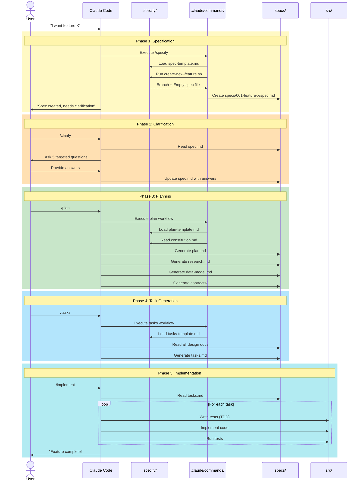

### Workflow Stages Explained

| Stage | Command | Input | Output | Purpose |
|-------|---------|-------|--------|---------|
| **1. Specify** | `/specify` | Feature description | `spec.md` | Define WHAT to build (requirements) |
| **2. Clarify** | `/clarify` | `spec.md` + questions | Updated `spec.md` | Resolve ambiguities |
| **3. Plan** | `/plan` | `spec.md` + constitution | `plan.md`, `research.md`, `data-model.md` | Define HOW to build (design) |
| **4. Tasks** | `/tasks` | All design docs | `tasks.md` | Break down into TODO items |
| **5. Implement** | `/implement` | `tasks.md` | `src/`, `tests/` | Write the actual code |
| **6. Analyze** | `/analyze` | All spec docs | Analysis report | Verify consistency |

---

## Constitutional Foundation

At the heart of spec-kit lies the **constitution**—a set of immutable principles that govern how specifications become code. Think of it as the architectural DNA that ensures every generated implementation maintains consistency, simplicity, and quality.

### What is the Constitution?

The constitution (`memory/constitution.md`) contains project-specific principles that guide ALL development decisions. Unlike regular documentation that describes what exists, the constitution **prescribes what must be**.

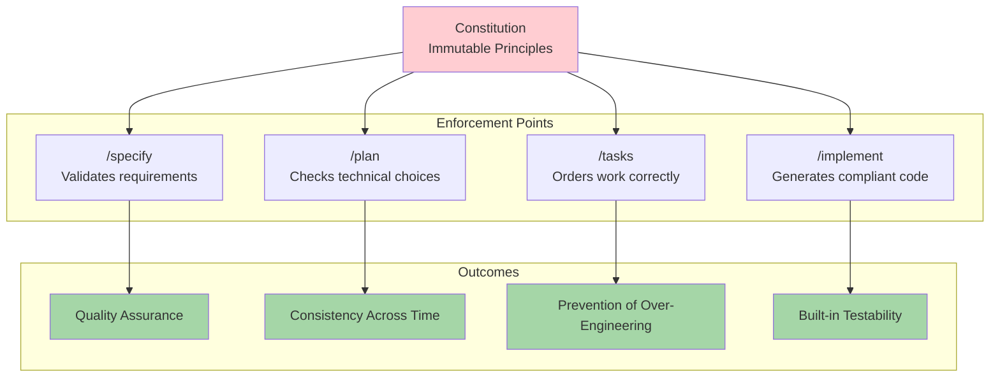

### Example: chan-meng Constitution

From the actual chan-meng project:

```markdown
## Core Principles

### I. Authenticity First
Every interaction must authentically represent Chan Meng's minimalist philosophy.
No embellishment or fictional elements allowed.

**Rationale**: Chan's story is powerful because it's real. Authenticity builds trust.

### III. Respect for User's Time (NON-NEGOTIABLE)
Users must be able to:
- Get a meaningful impression within 2 minutes
- Exit at any point without losing context
- Choose their own depth of exploration

**Rationale**: Chan practices minimalism by valuing "now" over unnecessary future
concerns. We must respect that user attention is precious.

### IV. Technical Simplicity
- Minimal dependencies (max 10 npm packages)
- Fast startup (< 2 seconds on average hardware)
- No external API calls or data collection

**Rationale**: Chan fits her life into a backpack and a suitcase. This CLI should
embody the same minimalist philosophy in its technical implementation.
```

### How Constitution Enforces Quality

#### 1. **Pre-Implementation Gates**

During `/plan`, the AI must pass constitutional checks before proceeding:

```markdown
## Constitution Check

### Principle IV (Technical Simplicity)
- [ ] Using ≤10 dependencies?
- [ ] Fast startup target documented?
- [ ] No external API calls?

**Status**: ✅ PASS
- 7 dependencies (inquirer, chalk, boxen, figlet, conf, ora, gradient-string)
- Startup target: <5 seconds
- Fully offline architecture
```

If a gate fails, the AI must either:
- Simplify the design to pass, OR
- Document justified complexity in "Complexity Tracking"

#### 2. **Explicit Violation Documentation**

When constitutional principles conflict with requirements, violations must be explicitly documented:

```markdown
## Complexity Tracking

| Violation | Why Needed | Simpler Alternative Rejected Because |
|-----------|------------|-------------------------------------|
| 11 dependencies | Need real-time updates | WebSocket library required; no simpler option exists |
| 4th project | Microservices architecture | Monolith would exceed 3-project limit per service |
```

This prevents accidental complexity—every deviation must be justified.

#### 3. **Continuous Compliance**

The constitution is checked at multiple stages throughout the workflow:

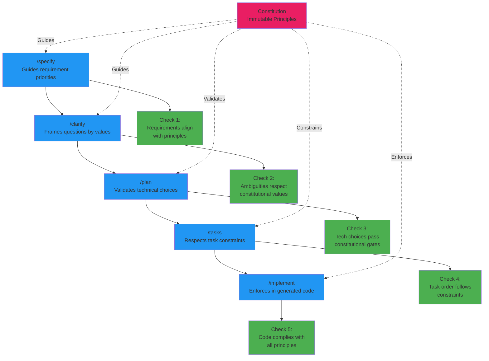

### Common Constitutional Principles

While each project has unique principles, common patterns include:

| Principle Type | Example | Enforcement |
|----------------|---------|-------------|
| **Dependency Limits** | "Max 10 npm packages" | Counted during planning |
| **Performance Targets** | "API response <200ms p95" | Becomes failing test |
| **Security Requirements** | "No hardcoded credentials" | Checked in code review |
| **Architecture Constraints** | "No circular dependencies" | Validated in build |
| **User Experience** | "Keyboard navigation required" | Integration tests verify |
| **Testing Standards** | "80% code coverage minimum" | CI pipeline enforces |

### Why Constitution Matters

**Traditional Approach**:
```
Developer A: "Let's add Redis for caching"
Developer B: "Sure" (6 months later: unused Redis cluster costs $500/month)
```

**With Constitution**:
```
Developer: "Add Redis for caching"
AI: "❌ Violates Principle IV (Technical Simplicity). Justify complexity."
Developer: "Actually, in-memory cache is sufficient"
AI: "✅ Generating in-memory implementation"
```

The constitution acts as an ever-present architectural reviewer, preventing drift and accumulation of unnecessary complexity.

### Evolution, Not Revolution

Constitutions can evolve through a documented amendment process:

```markdown
## Amendment History

### 2025-10-15: Updated Dependency Limit
**Previous**: Max 5 npm packages
**New**: Max 10 npm packages
**Rationale**: Modern CLI tools require richer terminal features
**Impact**: Existing projects grandfathered; new projects use new limit
```

This allows learning and adaptation while maintaining stability.

---

## Template-Driven Quality

The true power of spec-kit lies in how **templates constrain AI behavior** to produce higher-quality specifications. Templates aren't just formatting—they're sophisticated prompts that guide AI toward complete, testable, and maintainable specs.

### How Templates Work

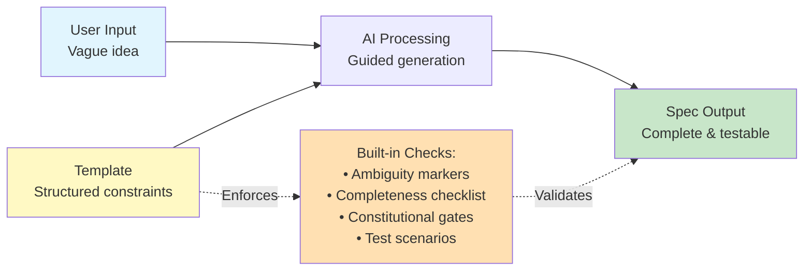

### 1. Preventing Premature Implementation

**Without Template** (typical AI response):

```markdown
User: Build a login system
AI: I'll implement email/password auth using bcrypt, JWT tokens,
    and store sessions in Redis...
```

**With Template** (spec-template.md):

```markdown
## Quick Guidelines
- ✅ Focus on WHAT users need and WHY
- ❌ Avoid HOW to implement (no tech stack, APIs, code structure)

FR-001: System MUST authenticate users
FR-002: System MUST support [NEEDS CLARIFICATION: auth method -
        email/password, SSO, OAuth, magic links?]
```

The template forces abstraction, keeping specs stable as tech evolves.

### 2. Forcing Explicit Uncertainty

**Template Instruction**:

```markdown
When creating this spec from a user prompt:
1. **Mark all ambiguities**: Use [NEEDS CLARIFICATION: specific question]
2. **Don't guess**: If unclear, mark it
3. **Think like a tester**: Every vague requirement should fail the checklist
```

**Result** (actual chan-meng spec):

```markdown
FR-006: "The Journey" module MUST present Chan's life story in
        chronological segments

[ORIGINAL AMBIGUITY MARKED]:
- [NEEDS CLARIFICATION: How many segments? Can users skip segments?]
- [NEEDS CLARIFICATION: Maximum segment length before breaking?]

[AFTER CLARIFICATION]:
- 4 main segments (early life, independent living, minimalism evolution, NZ life)
- Users can skip forward, not backward (prevents story confusion)
- Max 3 screens per segment before continue prompt
```

This prevents the AI from making plausible but incorrect assumptions.

### 3. Structured Self-Review

**Template Checklist**:

```markdown
## Review & Acceptance Checklist

### Content Quality
- [ ] No implementation details (languages, frameworks, APIs)
- [ ] Focused on user value and business needs
- [ ] Written for non-technical stakeholders

### Requirement Completeness
- [ ] No [NEEDS CLARIFICATION] markers remain
- [ ] Requirements are testable and unambiguous
- [ ] Success criteria are measurable
```

This forces the AI to evaluate its own output systematically, catching gaps.

### 4. Constitutional Compliance Gates

**From plan-template.md**:

```markdown
## Phase -1: Pre-Implementation Gates

### Simplicity Gate (Article VII)
- [ ] Using ≤3 projects for initial implementation?
- [ ] No speculative "might need" features?
- [ ] No future-proofing beyond current requirements?

### Anti-Abstraction Gate (Article VIII)
- [ ] Using framework features directly?
- [ ] No unnecessary wrapper layers?
- [ ] Single model representation (no DTO proliferation)?

**If ANY gate fails**:
→ Document in Complexity Tracking section with justification
→ Consider simpler alternatives
→ Get explicit approval before proceeding
```

**Real Example** (chan-meng project):

```markdown
## Constitution Check

✅ PASS: Simplicity Gate
- Single project (no microservices)
- All features justified by user stories
- No "future-proof" abstractions

✅ PASS: Anti-Abstraction Gate
- Using Inquirer directly (no custom prompt wrapper)
- Content modules are plain objects (no Content class hierarchy)
- Direct filesystem writes (no repository pattern)
```

### 5. Hierarchical Detail Management

**Template Instruction**:

```markdown
**IMPORTANT**: This plan should remain high-level and readable.
Code samples, detailed algorithms, and extensive technical specifications
MUST be placed in appropriate `implementation-details/` files.

Keep main document under 500 lines.
```

**Result**:

```
specs/001-feature/
├── plan.md (350 lines - high-level, readable)
└── implementation-details/
    ├── database-schema.sql (detailed schema)
    ├── api-contracts.json (OpenAPI spec)
    └── state-machine.md (complex logic)
```

This prevents the "everything in one file" problem that makes specs unreadable.

### 6. Test-First Thinking

**From tasks-template.md**:

```markdown
## Phase 3.2: Tests First (TDD) ⚠️ MUST COMPLETE BEFORE 3.3

**CRITICAL**: These tests MUST be written and MUST FAIL before ANY implementation

- [ ] T004 [P] Contract test POST /api/users
- [ ] T005 [P] Integration test user registration
- [ ] T006 [P] Integration test auth flow

## Phase 3.3: Core Implementation (ONLY after tests are failing)

- [ ] T007 User model
- [ ] T008 UserService CRUD
- [ ] T009 POST /api/users endpoint
```

This ordering constraint ensures testability is designed in, not bolted on.

### 7. Preventing Speculative Features

**Template Rule**:

```markdown
## Scope Definition

- [ ] No speculative or "might need" features
- [ ] All features trace to specific user stories
- [ ] Each requirement has clear acceptance criteria
```

**Effect**:

```markdown
❌ REJECTED by template:
FR-999: System MIGHT need to support real-time collaboration in the future

✅ ACCEPTED by template:
FR-015: System MUST allow users to choose between Quick Tour (2-3 min)
        and Full Experience modes

User Story: As a time-conscious user, I want a quick overview option
Acceptance: Quick Tour completes in <3 minutes and covers key highlights
```

### The Compound Effect

These constraints work together to produce specifications that are:

| Quality | How Template Ensures It | Example from chan-meng |
|---------|-------------------------|------------------------|
| **Complete** | Checklists catch missing sections | All 28 FRs have acceptance criteria |
| **Unambiguous** | Forced `[NEEDS CLARIFICATION]` | 5 clarifications answered before planning |
| **Testable** | Test-first task ordering | T003-T005 (tests) before T006-T009 (impl) |
| **Maintainable** | Proper abstraction levels | `spec.md` has no code; `plan.md` has no algorithms |
| **Constitutional** | Pre-implementation gates | 7 dependencies validated against 10-limit |
| **Implementable** | Clear phases with deliverables | 12 tasks in correct dependency order |

### Templates as "Unit Tests for English"

Just as unit tests validate code behavior, templates validate specification quality:

```markdown
Unit Test:          assert(user.age > 0)
Template Check:     [NEEDS CLARIFICATION: Age verification method not specified]

Unit Test:          assert(response.status === 200)
Template Check:     [ ] Requirements are testable and unambiguous

Unit Test:          assert(dependencies.length <= 10)
Template Check:     ✅ PASS: 7 dependencies (within 10 limit)
```

The templates transform AI from a creative writer into a disciplined specification engineer.

---

## Detailed Command Flow

### `/specify` - Create Feature Specification

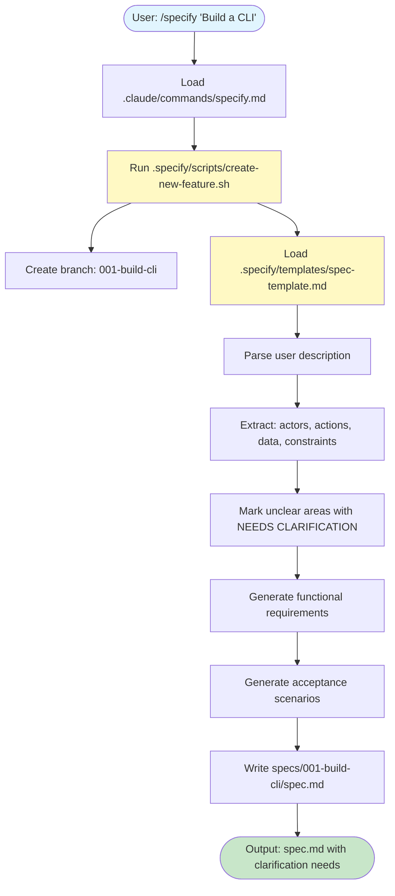

### `/plan` - Generate Implementation Plan

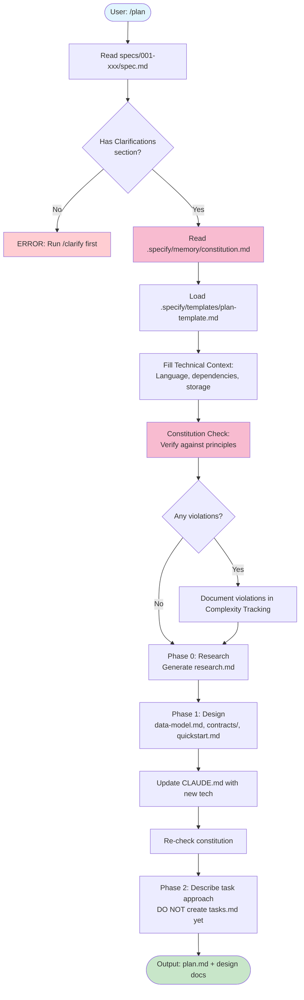

### `/tasks` - Generate Task List

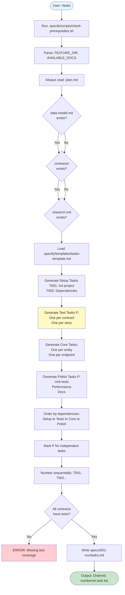

---

## File Relationships

### How Templates Become Documents

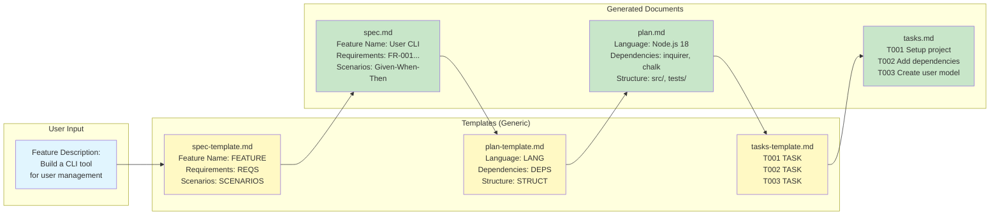

### Constitution's Influence

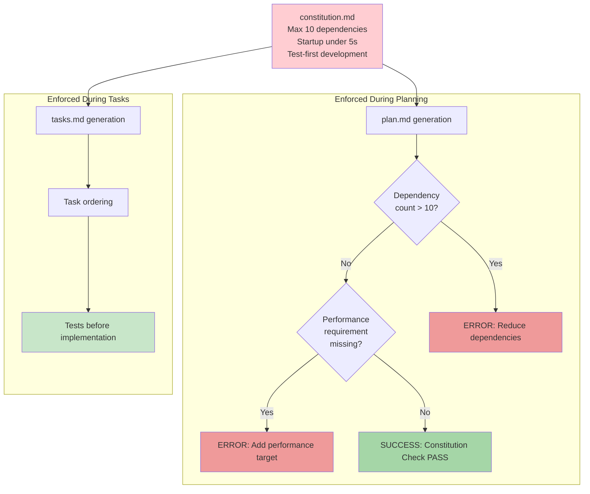

### Document Dependencies

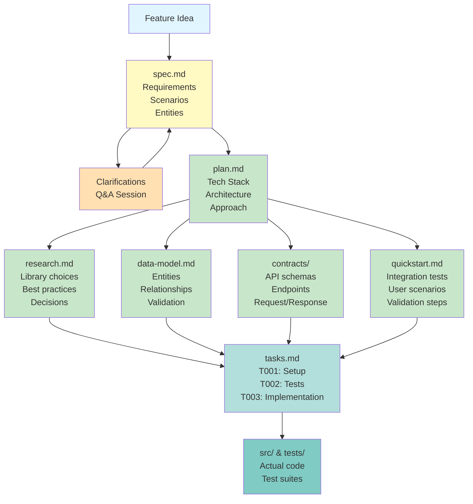

---

## Getting Started

### Prerequisites

1. **Claude Code CLI** installed and configured
2. **Git** for version control
3. **Project initialized** with spec-kit framework

### Quick Start Guide

#### 1. Initialize Your First Feature

```bash
# Start with a feature description
/specify Build a user authentication system with email and password login
```

This creates:
- New branch: `001-user-auth`
- Initial spec: `specs/001-user-auth/spec.md`

#### 2. Clarify Ambiguities

```bash
# Claude will identify unclear areas and ask questions
/clarify

# Answer questions like:
# - Should we support OAuth? → Yes, Google and GitHub
# - Session duration? → 7 days with refresh tokens
# - Password requirements? → Min 8 chars, must include number
```

#### 3. Generate Implementation Plan

```bash
# Creates technical design documents
/plan

# Generates:
# - plan.md (technical approach)
# - research.md (library choices, best practices)
# - data-model.md (User entity, Session entity)
# - contracts/ (POST /auth/login, POST /auth/register)
# - quickstart.md (test scenarios)
```

#### 4. Create Task List

```bash
# Breaks down implementation into ordered tasks
/tasks

# Generates tasks.md with:
# T001: Setup Express.js project
# T002: Install dependencies (bcrypt, jsonwebtoken)
# T003: [P] Contract test POST /auth/register
# T004: [P] Contract test POST /auth/login
# T005: User model with password hashing
# ...
```

#### 5. Implement

```bash
# Execute tasks in order
/implement

# Claude will:
# 1. Write failing tests (TDD)
# 2. Implement code to pass tests
# 3. Run validation
# 4. Move to next task
```

### Best Practices

1. **Always Clarify First**: Don't skip `/clarify` - it saves rework later
2. **Trust the Constitution**: If it flags violations, there's usually a simpler way
3. **Follow TDD**: Tests before implementation, always
4. **Commit Per Task**: Each completed task = one commit
5. **Review Generated Docs**: They guide implementation, ensure they're accurate

### Common Patterns

#### Pattern 1: Quick Feature
```bash
/specify Add dark mode toggle
/clarify  # Answer quick questions
/plan     # Generate design
/tasks    # Get task list
/implement # Build it
```

#### Pattern 2: Complex Feature
```bash
/specify Build real-time chat system
/clarify  # Multiple clarification rounds may be needed
/plan     # Extensive research phase
/analyze  # Verify consistency before tasks
/tasks    # Detailed task breakdown
/implement # Execute in stages
```

#### Pattern 3: Update Existing Feature
```bash
# Switch to feature branch
git checkout 001-user-auth

# Update spec with new requirements
/specify Add two-factor authentication

# Re-run planning with new context
/plan

# Generate updated tasks
/tasks

# Implement changes
/implement
```

---

## Understanding Key Concepts

### What Makes spec-kit Special?

1. **Constitution-Driven Development**
   - Your `constitution.md` defines non-negotiable principles
   - Every design decision is checked against these principles
   - Prevents feature creep and maintains project integrity

2. **Test-First Workflow**
   - Contract tests are generated from API schemas
   - Integration tests come from user scenarios
   - Implementation tasks come after test tasks

3. **AI-Optimized**
   - Templates guide AI to generate consistent documentation
   - Commands provide clear context boundaries
   - Task breakdown enables parallel AI execution

4. **Documentation That Evolves**
   - Specs aren't written once and forgotten
   - They're living documents that reflect reality
   - Code and docs stay in sync

### Why Three Layers?

The three-layer architecture (`.specify/`, `.claude/commands/`, `specs/`) provides:

- **Separation of Concerns**: Framework, orchestration, and data are independent
- **Reusability**: One `.specify/` folder serves all features
- **Version Control**: Templates evolve separately from feature docs
- **Scalability**: Add features without modifying framework
- **Maintainability**: Update one template, affects all future features

---

## Troubleshooting

### Common Issues

#### "Command not found: /specify"

**Cause**: Commands not loaded or `.claude/commands/` missing

**Solution**:
```bash
# Verify commands directory exists
ls .claude/commands/

# Reload Claude Code
# Commands should auto-load on startup
```

#### "Template not found"

**Cause**: `.specify/` directory missing or moved

**Solution**:
```bash
# Verify .specify structure
tree .specify/

# Should show templates/, scripts/, memory/
```

#### "Constitution violations detected"

**Cause**: Design conflicts with principles in `constitution.md`

**Solution**:
1. Read the violation message carefully
2. Either simplify your design or
3. Document why the violation is justified in `plan.md`'s Complexity Tracking section

#### "No feature spec found"

**Cause**: Trying to run `/plan` before `/specify`

**Solution**: Always follow the workflow order:
```bash
/specify → /clarify → /plan → /tasks → /implement
```

---

## Advanced Topics

### Customizing Templates

You can modify `.specify/templates/` to fit your project's needs:

```markdown
<!-- Add custom section to spec-template.md -->
## Security Considerations
*Mandatory for all features*

- [ ] Input validation strategy
- [ ] Authentication requirements
- [ ] Authorization rules
- [ ] Data encryption needs
```

### Custom Commands

Add your own slash commands in `.claude/commands/`:

```markdown
<!-- .claude/commands/review.md -->
---
description: Code review checklist for completed features
---

1. Run tests: npm test
2. Check coverage: npm run coverage
3. Verify spec alignment
4. Check for TODOs
5. Review error handling
```

### Multi-Project Constitutions

For monorepos with different principles per project:

```
.specify/
└── memory/
    ├── constitution.md        # Root principles
    ├── frontend-constitution.md
    └── backend-constitution.md
```

Reference in your commands:
```bash
# Load specific constitution
CONSTITUTION=".specify/memory/frontend-constitution.md"
```

---

## Conclusion: The Future of Software Development

spec-kit represents a fundamental shift in how we build software. For decades, we've accepted the gap between intention and implementation, between documentation and reality, between yesterday's decisions and today's code. **Spec-Driven Development eliminates these gaps.**

### The Power Inversion in Practice

#### Traditional Development: Code-Centric with Inevitable Drift

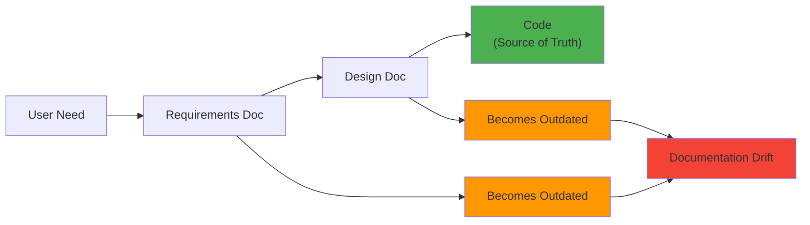

#### Spec-Driven Development: Specifications as Source of Truth

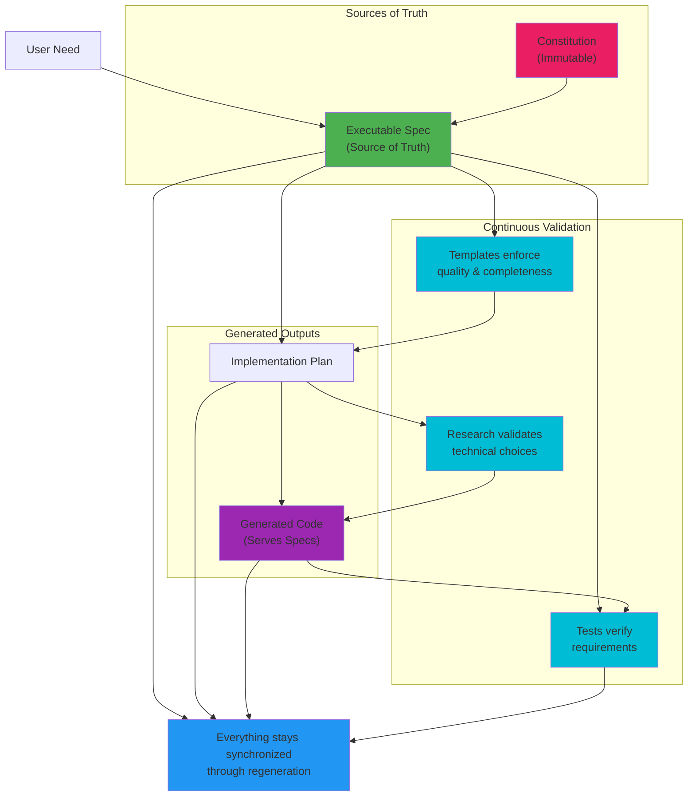

### What You've Learned

Through this guide, you've explored:

1. **The Philosophy**: Specifications drive code, not the other way around
2. **The Architecture**: Three-layer separation (framework, interface, data)
3. **Real Implementation**: chan-meng CLI built entirely with spec-kit
4. **Constitutional Enforcement**: Immutable principles prevent drift
5. **Template-Driven Quality**: Structured constraints guide AI behavior
6. **Complete Workflow**: From vague idea to tested implementation

### Key Principles to Remember

| Principle | Traditional Approach | Spec-Driven Approach |
|-----------|---------------------|---------------------|
| **Source of Truth** | Code is truth; docs drift | Specs are truth; code regenerates |
| **Requirements Change** | Manual propagation, technical debt | Update spec → regenerate implementation |
| **Quality Assurance** | Post-hoc testing and reviews | Built-in through templates and constitution |
| **AI Utilization** | Vibe coding with prompts | Structured generation with guardrails |
| **Parallel Exploration** | Expensive rewrites | Same spec, multiple implementations |
| **Documentation** | Becomes outdated quickly | Always current (generates the code) |

### The chan-meng Example Revisited

Remember how chan-meng was built:

1. **Constitution established** → Principles like "max 10 dependencies" and "<5s startup"
2. **Specification created** → 28 functional requirements from natural language
3. **Ambiguities resolved** → `/clarify` prevented assumptions
4. **Plan validated** → Constitutional gates checked (7 deps ✅, <5s target ✅)
5. **Tasks generated** → Ordered list with dependencies and parallel markers
6. **TDD implementation** → Tests first, then code to pass tests

**Result**: A production CLI that perfectly matches its specification, with zero drift between docs and reality.

### Why This Matters for You

**If you're a developer**:
- Focus on "what" and "why" rather than mechanical translation
- Explore multiple implementations without rewriting from scratch
- Never let documentation become outdated
- Constitutional enforcement prevents accidental complexity

**If you're a product manager**:
- Requirements stay the source of truth throughout development
- Pivots become spec updates, not painful rewrites
- Living documentation always reflects reality
- Clear traceability from user story to implementation

**If you're an architect**:
- Constitutional principles enforced automatically
- Complexity must be justified explicitly
- Same specification can generate different tech stacks
- Research context captured and versioned

### Common Pitfalls to Avoid

1. **Skipping `/clarify`**: Don't let AI guess. Ambiguities caught early prevent rework later.

2. **Ignoring Constitution Violations**: If a gate fails, either simplify OR document justification. Never ignore.

3. **Writing Implementation Details in Specs**: Keep specs about WHAT and WHY. Let plan.md handle HOW.

4. **Treating Templates as Boilerplate**: Templates are sophisticated prompts that guide AI. Customize them for your domain.

5. **Bypassing TDD Order**: Tests before implementation. Always. No exceptions.

### Getting Started Today

Ready to try Spec-Driven Development? Here's your path:

#### Week 1: Learn the System
- Read this guide thoroughly
- Explore the chan-meng project structure
- Run `npx chan-meng` to see the result

#### Week 2: Start Small
- Use `specify init` to bootstrap a project
- Create constitution with 3-5 core principles
- Build one small feature end-to-end

#### Week 3: Iterate and Refine
- Add features iteratively
- Adjust constitutional principles as you learn
- Customize templates for your domain

#### Week 4: Share Knowledge
- Document your team's conventions
- Train others on the workflow
- Contribute improvements back to spec-kit

### The Transformation

This isn't just a new tool or process—it's a fundamental rethinking of how software gets built:

- **From vibe coding** → To structured specification
- **From drift** → To synchronization
- **From manual translation** → To guided generation
- **From forgotten principles** → To constitutional enforcement
- **From outdated docs** → To living documentation
- **From one-shot code** → To regenerable implementations

### Join the Movement

Spec-Driven Development is still evolving. As you use spec-kit:

- **Share your experiences**: What works? What doesn't?
- **Contribute templates**: Domain-specific templates help everyone
- **Propose constitutional principles**: Common patterns become best practices
- **Report issues**: Help make the system better

### The Ultimate Goal

The goal isn't to replace developers with AI. It's to **amplify human creativity** by:

- Automating mechanical translation from specs to code
- Enforcing quality through templates and constitutions
- Enabling rapid exploration of alternatives
- Maintaining perfect alignment between intent and reality

When specifications become executable, developers can focus on the hard problems: understanding users, designing experiences, making architectural tradeoffs, and creative problem-solving.

The computer handles the translation. You handle the thinking.

---

## Further Resources

- **Official spec-kit Repository**: [github.com/github/spec-kit](https://github.com/github/spec-kit)
- **chan-meng CLI Source**: This project—explore how it was built
- **Specification Documents**: Check `specs/001-build-an-interactive/` for real examples
- **Templates**: Review `.specify/templates/` to understand the structure
- **Constitution Example**: See `.specify/memory/constitution.md`

---

## Quick Reference Card

### Essential Commands

| Command | Purpose | When to Use |
|---------|---------|-------------|
| `/specify <description>` | Create feature spec | Start of every feature |
| `/clarify` | Resolve ambiguities | After spec, before plan |
| `/plan <tech choices>` | Generate implementation plan | After clarified spec |
| `/tasks` | Break down into tasks | After plan validation |
| `/implement` | Execute implementation | After task review |
| `/analyze` | Check consistency | Before implementation |

### Key Files

| File | Purpose | Lives Where |
|------|---------|-------------|
| `constitution.md` | Project principles | `.specify/memory/` |
| `spec.md` | Feature requirements | `specs/###-feature/` |
| `plan.md` | Technical approach | `specs/###-feature/` |
| `tasks.md` | Ordered task list | `specs/###-feature/` |
| `*-template.md` | Spec generators | `.specify/templates/` |

### Remember

✅ **Constitution → Specs → Plan → Tasks → Code** (never skip a step)
✅ **Clarify ambiguities early** (saves massive rework later)
✅ **Test before implementation** (TDD is non-negotiable)
✅ **Document constitutional violations** (complexity must be justified)
✅ **Templates are prompts** (they guide AI behavior)

---

**Happy Building with spec-kit!** 🚀

*This guide was written to help you understand and adopt Spec-Driven Development. The chan-meng CLI you're reading about was built entirely using this methodology—proving that specifications truly can drive implementation.*

**Questions? Issues? Improvements?**
- Star the [spec-kit repository](https://github.com/github/spec-kit)
- Open an issue for questions or problems
- Contribute your learnings back to the community

*Remember: Code serves specifications. Specifications serve users. That's the inversion that changes everything.*
