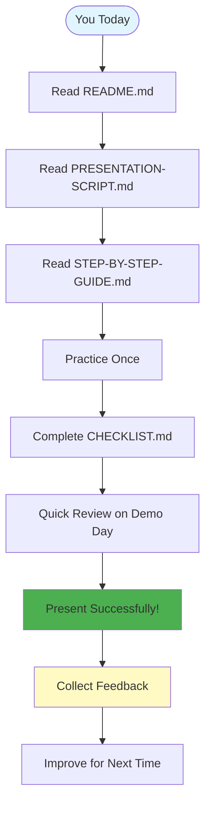

# Demo Package File Structure

## Complete File Map

```
demo-spec-kit-walkthrough/
│
├── 📖 DOCUMENTATION (Read these first)
│   ├── README.md                    # Start here - Complete overview
│   ├── QUICK-START.md              # Fast track guide (5 min read)
│   ├── PRESENTATION-SCRIPT.md      # Full narration with timing
│   ├── STEP-BY-STEP-GUIDE.md       # Detailed technical execution
│   ├── CHECKLIST.md                # Pre-demo preparation
│   └── FILE-STRUCTURE.md           # This file
│
├── 📝 PROMPTS (Copy-paste during demo)
│   ├── 01-constitution.txt         # /speckit.constitution prompt
│   ├── 02-specify.txt              # /speckit.specify prompt
│   ├── 03-clarify.txt              # /speckit.clarify prompt
│   ├── 04-plan.txt                 # /speckit.plan prompt
│   ├── 05-tasks.txt                # /speckit.tasks prompt
│   └── 06-implement.txt            # /speckit.implement prompt
│
└── 📂 EXPECTED-OUTPUTS (Backup if live demo fails)
    ├── constitution.md             # Example constitution output
    ├── spec.md                     # Example specification output
    ├── plan.md                     # Example plan output
    └── tasks.md                    # Example tasks output
```

## File Purposes

### Primary Documents

**README.md** (10 min read)
- What: Complete overview of the demo package
- Why: Understand the project structure and learning objectives
- When: Read first before anything else
- Contains: Diagrams, flow charts, terminology

**QUICK-START.md** (5 min read)
- What: Fast-track guide for urgent presentations
- Why: Get demo-ready in under 10 minutes
- When: You're presenting today and need prep NOW
- Contains: Minimal steps, cheat sheets, emergency plans

**PRESENTATION-SCRIPT.md** (15 min read)
- What: Complete narration with timing
- Why: Know exactly what to say and when
- When: Your speaking notes during presentation
- Contains: Full script, audience interaction points, timing

**STEP-BY-STEP-GUIDE.md** (10 min read)
- What: Technical execution details
- Why: Exact commands and expected behaviors
- When: Technical reference during presentation
- Contains: Commands, verification steps, troubleshooting

**CHECKLIST.md** (5 min to complete)
- What: Pre-demo preparation checklist
- Why: Ensure everything works before going live
- When: 15-30 minutes before presentation
- Contains: Environment setup, backups, final checks

### Prompt Files

All files in `prompts/` are ready-to-copy text:

**01-constitution.txt**
- Command: `/speckit.constitution`
- Phase: 1 (2-5 min)
- Creates: Constitutional principles for the project

**02-specify.txt**
- Command: `/speckit.specify`
- Phase: 2 (5-9 min)
- Creates: Feature specification with requirements

**03-clarify.txt**
- Command: `/speckit.clarify`
- Phase: 3 (9-11 min)
- Creates: Resolved ambiguities in spec

**04-plan.txt**
- Command: `/speckit.plan`
- Phase: 4 (11-15 min)
- Creates: Technical implementation plan

**05-tasks.txt**
- Command: `/speckit.tasks`
- Phase: 5 (15-17 min)
- Creates: Ordered task breakdown

**06-implement.txt**
- Command: `/speckit.implement`
- Phase: 6 (17-25 min)
- Creates: Working code

### Expected Outputs

Files in `expected-outputs/` show what Claude SHOULD generate:

**constitution.md**
- Shows: 3 principles with enforcement
- Use when: Constitution generation fails
- Key features: Gates, rationale, amendment process

**spec.md**
- Shows: 26 functional requirements
- Use when: Specification generation fails
- Key features: FRs, scenarios, clarifications

**plan.md**
- Shows: Technical design with constitutional check
- Use when: Planning generation fails
- Key features: 3 dependencies, ✅ PASS gates

**tasks.md**
- Shows: 16 ordered tasks with [P] markers
- Use when: Task generation fails
- Key features: TDD ordering, parallel tasks

## Usage Patterns

### First Time Presenter

```
Day 1: Read README.md (10 min)
Day 2: Read PRESENTATION-SCRIPT.md (15 min)
Day 3: Practice with STEP-BY-STEP-GUIDE.md (30 min)
Day 4: Complete CHECKLIST.md (15 min)
Day 5: Present! Use QUICK-START.md for last-minute review
```

### Experienced Presenter

```
Hour 1: Skim README.md, focus on QUICK-START.md
Hour 2: Practice run with prompts/
Hour 3: Present with PRESENTATION-SCRIPT.md open
```

### Emergency (Presenting in 30 minutes)

```
Min 1-5: Read QUICK-START.md
Min 6-10: Setup environment (CHECKLIST.md basics)
Min 11-20: Practice once with prompts/
Min 21-25: Review PRESENTATION-SCRIPT.md key points
Min 26-30: Test screen visibility, deep breath, GO!
```

## Document Relationships

```
Start Here
    ↓
README.md ──→ QUICK-START.md (if rushed)
    ↓              ↓
PRESENTATION-SCRIPT.md (what to say)
    ↓
STEP-BY-STEP-GUIDE.md (what to type)
    ↓
prompts/ (actual text to copy)
    ↓
expected-outputs/ (backup plan)
    ↓
CHECKLIST.md (before going live)
    ↓
Present!
```

## Minimum Required Reading

If you have limited time:

**15 minutes available:**
- QUICK-START.md (5 min)
- Skim PRESENTATION-SCRIPT.md (5 min)
- Skim prompts/ (5 min)

**30 minutes available:**
- README.md (10 min)
- PRESENTATION-SCRIPT.md (15 min)
- Quick practice (5 min)

**1 hour available:**
- All of the above
- Plus STEP-BY-STEP-GUIDE.md (10 min)
- Plus complete CHECKLIST.md (10 min)
- Plus full practice run (20 min)

## File Sizes

| File | Lines | Read Time |
|------|-------|-----------|
| README.md | ~400 | 10 min |
| QUICK-START.md | ~350 | 5 min |
| PRESENTATION-SCRIPT.md | ~500 | 15 min |
| STEP-BY-STEP-GUIDE.md | ~600 | 10 min |
| CHECKLIST.md | ~400 | 5 min (to complete) |
| Prompts (all) | ~100 | 2 min |
| Expected outputs (all) | ~1000 | Reference only |

**Total package**: ~3,350 lines of documentation

## Success Path



## Questions About Files?

- **"Which file do I present from?"** → PRESENTATION-SCRIPT.md (keep open)
- **"Where are the commands?"** → prompts/ folder (copy-paste from these)
- **"What if live demo fails?"** → expected-outputs/ folder (show these)
- **"How do I prepare?"** → CHECKLIST.md (complete this)
- **"I'm presenting in 1 hour!"** → QUICK-START.md (start here)

## Contribution

Want to improve this demo package?

1. Present using these files
2. Note what worked / what didn't
3. Update documents with your learnings
4. Share improvements back

## License

This demo package is part of the chan-meng project and follows the same MIT license.

---

**You have everything you need to succeed!** 🚀

Pick your starting point based on time available, follow the path, and present with confidence.
